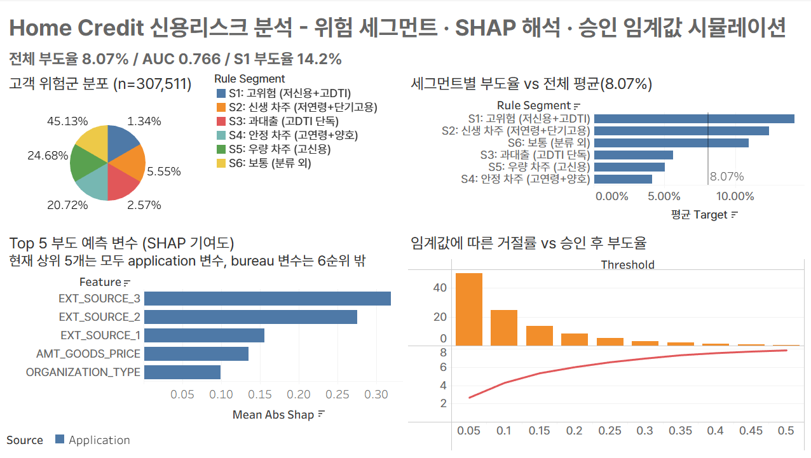

# Home Credit Default Risk - 금융권 신용리스크 분석

> 송정민 금융권 데이터분석가 트랙 메인 자산 (3개 자산 포트폴리오 중 50%)

## TL;DR

- 데이터: Home Credit Default Risk (Kaggle 2018). `application_train` 307,511행 x 122열 + `bureau.csv` 1,716,428행
- 모델: LightGBM AUC 0.7605(application only) → 0.7663(+bureau, 최종 채택). XGBoost 0.7667(+bureau)로 근소 우위지만 해석 용이성 위해 LightGBM 채택
- 차별화: bureau 데이터 조인/집계, PSM 인과추론, 비즈니스 임팩트 임계값 시뮬레이션, SHAP 해석, Selection bias 자기진단
- narrative: 단순 모델 정확도가 아니라 누구를 어떤 이유로 거절/승인할지 설명 가능한 신용리스크 분석

## 노트북 순서

| 노트북 | 핵심 산출물 |
|---|---|
| [01 EDA](notebooks/01_eda.ipynb) | 부도율 8.07%(극도 불균형). EXT_SOURCE 3종이 최강 예측변수(TARGET과 상관 -0.15~-0.18). DAYS_EMPLOYED=365243(18%)은 무직이 아닌 연금수급자로 규명(부도율 오히려 낮음). 나이 단조감소(20대 11.4%→60대 4.9%). 교육수준 강력(중졸 10.9%→석박사 1.8%) |
| [02 가설검정](notebooks/02_hypothesis_testing.ipynb) | t-test, chi-square + effect size로 6개 가설 검증. EXT_SOURCE_2만 유의미한 단변량 신호(Cohen's d 0.597), 직업(Cramér's V 0.082), 연령(0.076), 교육(0.058)은 방향은 맞으나 약함. 30만 표본이라 p-value는 전부 유의해서 effect size로 옥석 가림 |
| [03 bureau 조인](notebooks/03_bureau_join.ipynb) | 외부 신용정보국 데이터 조인. bureau 기록 보유 85.7%(263,491명), 파생변수 56개(수치 집계 37 + 더미 19). 연체이력 있으면 부도율 16.20%, 없으면 7.62%로 가장 강한 bureau 신호(+8.58%p) |
| [04 PSM 인과추론](notebooks/04_psm_causal.ipynb) | `has_bureau` 효과가 진짜 인과인지 검증. Naive 차이 -2.40%p, 매칭 후 ATT -2.14%p [95% CI: -2.30, -1.99]. 관찰 차이의 일부는 나이/소득 등 confounder였고 나머지는 실제 인과 효과 |
| [05 세그먼테이션](notebooks/05_segmentation.ipynb) | 비즈니스 룰 6개(S1~S6) + K-means(k=5) 비교, ARI 0.201(부분 일치). 해석가능성 위해 룰 기반 세그먼트 채택 |
| [06 모델 + 비즈니스 임팩트](notebooks/06_model.ipynb) | LGB-A/LGB-B/XGB-B 비교, 임계값 0.05~0.5 시뮬레이션(거절률, 승인 후 부도율, 기대손실) |
| [07 SHAP 해석](notebooks/07_shap_report.ipynb) | 전역 중요도(Top: EXT_SOURCE_3/2/1, AMT_GOODS_PRICE), dependence plot, 세그먼트별 기여도 차이, TP/FN/FP 개별사례 해석 |

## Tableau 대시보드

단일 페이지 4 차트 + KPI 띠(전체 부도율 8.07% / 모델 AUC 0.766 / S1 고위험군 부도율 14.2%)

1. 고객 위험군 분포 (세그먼트별 비중)
2. 세그먼트별 부도율 vs 전체 평균
3. Top 5 부도 예측 변수 (SHAP)
4. 임계값에 따른 거절률 vs 승인 후 부도율

차트별 의도는 [`tableau/README.md`](tableau/README.md) 참고.

## Selection Bias 자기 진단

본 데이터셋에는 과거에 승인되어 대출이 실행된 고객만 포함됩니다.

- 거절된 신청자의 정보는 처음부터 데이터에 없음 (survivorship bias)
- 본 모델은 승인 고객 내 부도 예측이지 신청자 일반의 부도 예측이 아님
- 실무 활용 시 외부 평점, 기존 거절 규칙과 함께 사용해야 일반화 가능

이 한계는 신용리스크 모델 일반의 근본 제약이며, 본 프로젝트의 자기 진단 포인트입니다.

## 모델 성능

| 모델 | 데이터 | AUC | AUPRC |
|---|---|---|---|
| LGB-A | application only | 0.7605 | 0.2520 |
| LGB-B (최종 채택) | + bureau | 0.7663 | 0.2628 |
| XGB-B | + bureau | 0.7667 | 0.2642 |

bureau 데이터 추가로 AUC +0.006, AUPRC +0.011 개선. XGB-B가 근소 우위지만 SHAP 해석과 재현성 관점에서 LGB-B를 최종 모델로 채택.

## 인과추론 하이라이트 (PSM)

- 관찰(Naive): bureau 기록 있는 고객의 부도율이 2.40%p 낮음
- 매칭 후(ATT): -2.14%p [CI: -2.30, -1.99]. 신뢰구간이 0을 포함하지 않아 bureau 기록 없음 자체가 인과적으로 부도 위험 신호임을 확인
- 나이/소득 등 관찰 가능한 confounder는 통제했으나, 측정 안 된 요인(재정관리 습관 등)은 한계로 남음

## 비즈니스 임팩트 시뮬레이션

`outputs/tables/06_threshold_simulation.csv` 참고. 승인 임계값 0.05~0.5 구간에서 거절률, 승인 후 부도율, 차단 부도건수, 잔존 기대손실(억원)의 트레이드오프를 계량화해 공격적/보수적 운영 모드 선택 시 경영진 의사결정을 지원.

## 재현 방법

1. Kaggle에서 `application_train.csv`, `bureau.csv` 다운로드 후 `data/raw/`에 배치
2. 노트북 01~07 순서대로 실행 (Jupyter, 커널: Anaconda base / Python 3.11.5)
3. Tableau Public Desktop으로 `tableau/dashboard.twbx` 열기

## 3개 자산 포트폴리오 맥락

| 자산 | 비중 | 역할 |
|---|---|---|
| Bank Churn | 30% | ML 기본기, AICE 대비 |
| Home Credit Default Risk (본 프로젝트) | 50% | 금융권 분석가 메인. 신용리스크, 인과추론, SHAP, BI |
| 구름한입 v2 | 20% | 1st party 데이터, 코호트, 리텐션 |
